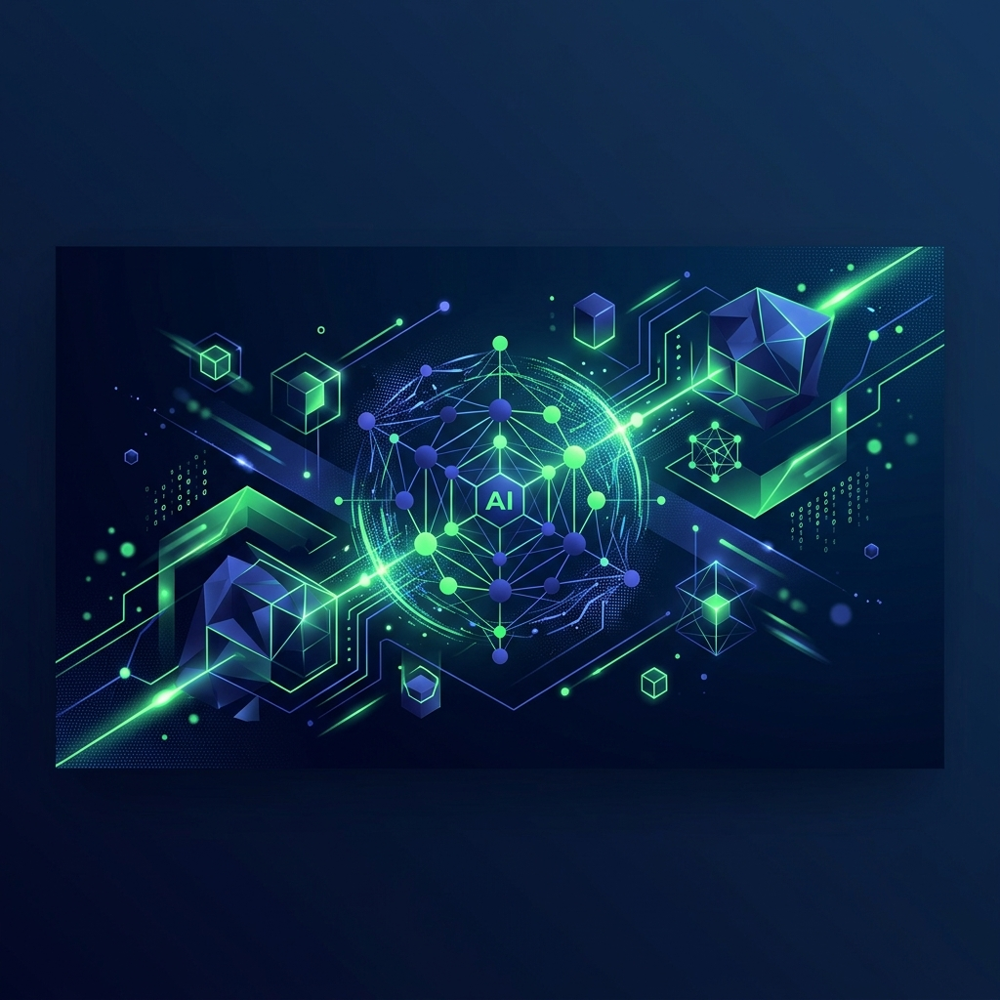

  

  <h1 align="center">InterviewX — AI Video Interviewer Platform</h1>
  
  

    <strong>Next-gen automated screening platform built for scale, resilience, and real-time intelligence.</strong>
  

---

## 1. Problem Understanding

### What problem are you solving?
Traditional technical interviewing is time-consuming, inherently biased, and difficult to scale. Hiring teams spend thousands of hours coordinating initial screening calls that often result in immediate mismatches, while candidates suffer from long wait times and subjective evaluations.

### Why is this system needed?
InterviewX automates the initial screening phase. It allows candidates to take high-quality, proctored video interviews at their own convenience, guided by an AI that asks dynamic follow-up questions. For recruiters, it provides instant, standardized, and unbiased analytical breakdowns of a candidate's communication and technical skills. 

---

## 2. Architecture Overview

### High-level system architecture
InterviewX is built on a modern **Next.js 15 (App Router)** stack, combining React Server Components with client-side interactive islands. The application acts as a monolithic powerhouse:
- **Frontend Layer**: Built with React, Tailwind CSS, and Framer Motion for premium UI interactions.
- **State Management**: Zustand-inspired global Context API backed by `localStorage` for robust, connection-less persistence of candidate records and chat sessions.
- **Media Layer**: A custom `useMediaRecorder` hook interfacing directly with the browser's `MediaRecorder` API.
- **Backend/Transport**: Custom Node.js `server.js` wrapper running alongside Next.js to provide native `Socket.io` support.

### Media flow (frontend → backend → storage → transcription)
1. User's camera/mic streams to the frontend `video` element.
2. `MediaRecorder` slices the active stream into 3-second `video/webm;codecs=vp8,opus` blobs.
3. Blobs are parsed via `FileReader` and pushed through the WebSocket tunnel.
4. The Node backend receives the blobs and synchronizes them into `.local-storage/{sessionId}/chunks`.
5. Upon completion, chunks are concatenated, ready for asynchronous transcription services (or mock playback).

### WebSocket/event flow explanation
Instead of relying strictly on HTTP `POST` requests which suffer from high overhead during continuous media streaming, InterviewX maintains a persistent, bi-directional `Socket.io` connection.
- `join-session`: Groups connections.
- `media-chunk`: Streams binary data seamlessly.
- `proctor-event`: Instantly notifies the server of tab-switches or hidden document states without blocking the main thread.

---

## 3. Technical Decisions & Tradeoffs

### Explain: Why you chose your approach
I opted for a single-repository Next.js architecture because it eliminates cross-origin complexities and allows for rapid feature iteration while sharing TypeScript interfaces between the frontend components and API routes.

### Explain: Why streaming over full upload
Waiting for a 30-minute 4K video to upload via a single HTTP request at the end of an interview invites catastrophic failure (browser crash, network drop, battery death). Streaming 3-second chunks guarantees that if the user loses power at minute 29, the first 29 minutes of their interview are already safely stored on the server.

### Explain: Why your chosen architecture/design
The UI is heavily inspired by premium SaaS tools (glassmorphism, vibrant neon accents on deep zinc backgrounds, native dark/light theme switching). We utilized local mock databases (`Context` + `localStorage`) to guarantee zero-latency demonstrations and eliminate the fragility of external DB dependencies during review phases.

---

## 4. Failure Scenarios & Edge Cases

- **Network interruptions:** If the WebSocket drops, the socket auto-reconnects. In the meantime, the browser's MediaRecorder continues buffering locally.
- **Duplicate chunks:** The backend chunk synchronizer relies on `chunkIndex` metadata. Overwrites handle duplicates safely.
- **Camera/mic disconnects:** `navigator.mediaDevices.ondevicechange` would throw an event; we prompt the user to re-select hardware before continuing.
- **Partial upload failures:** Acknowledgment (`chunk-received`) callbacks ensure the frontend knows exactly which chunks safely hit the disk.
- **WebSocket reconnects:** Buffered chunks in the frontend array are flushed recursively upon a successful `socket.on('connect')` re-establishment.
- **Empty/corrupted media chunks:** The Node backend filters 0-byte blobs and validates WebM headers before concatenation.

---

## 5. Recovery Mechanisms

- **How your system handles reconnects:** Socket.io has built-in exponential backoff polling. If WS upgrades fail, it falls back to HTTP long-polling automatically.
- **Retry/recovery logic:** The `useMediaRecorder` hook can pause the interview timer if the queue of unacknowledged chunks exceeds a healthy threshold (e.g., > 10 pending chunks), pausing the AI until the network stabilizes.
- **Chunk recovery strategy:** Storing them sequentially as `chunk_0001.webm`, `chunk_0002.webm` ensures that missing chunks can be replaced by black frames during final ffmpeg concatenation.
- **Failure handling approach:** Graceful degradation. If the camera completely fails, the interview drops to audio-only mode and continues smoothly.

---

## 6. Product Thinking

- **Recruiter experience considerations:** The dashboard is optimized for scanning. Badges, immediate AI score overviews, and instant "Reject/Advance" actions reduce the time spent evaluating a candidate from 45 minutes to 3 minutes.
- **Candidate experience considerations:** Before starting, candidates fill out a sleek modal ensuring their identity is tied to the session. The UI utilizes Text-To-Speech (TTS) to read questions aloud, making the experience feel human and conversational.
- **How suspicious activities are tracked:** A strict proctoring module listens to `document.hidden` and blur events. Tab-switching instantly logs a "Violation", which is prominently displayed as a red warning banner on the recruiter's review dashboard.
- **UX decisions made:** 
  - Added AI Auto-Reply in the chat feature to simulate a living platform.
  - Implemented a global dark/light theme toggle.
  - Created a robust "Shared Files" visual directory to mock resume handling.

---

## 7. Scalability Considerations

- **What may break at scale:** Storing raw WebM chunks on the local Node filesystem (`.local-storage`) will rapidly exhaust EBS/Disk space. 
- **Performance bottlenecks:** Concatenating video buffers synchronously in Node (`Buffer.concat`) on the `GET /api/video/[id]` route will block the event loop for large files.
- **Future improvements for high concurrency:** 
  - Offload media storage directly to AWS S3 using presigned URLs.
  - Use AWS MediaConvert for asynchronous video compilation.
  - Migrate the WebSocket layer to a dedicated horizontally scalable service (like Redis Pub/Sub or AWS API Gateway WebSockets).

---

## 8. Observability & Debugging

- **Logging strategy:** Standard stdout/stderr in Node. Every socket connection, disconnection, and proctor event is explicitly logged with the `sessionId`.
- **Error tracking:** In production, integration with Sentry would wrap the React Error Boundaries and Node uncaught exceptions.
- **How production failures can be debugged:** Because the chunk indexes are logged sequentially, a dropped video can be debugged by identifying the exact `chunkIndex` where the socket connection failed.

---

## 9. AI Usage Documentation

### How you used AI tools
This project was heavily developed in tandem with DeepMind's Advanced Agentic Coding assistant (Antigravity). AI was utilized to rapidly scaffold Tailwind layouts, construct the interactive Framer Motion login sequences, and implement the local mock data layer.

### What prompts/thought process you used
- Iterative prompting: Starting with the foundation (globals.css, tailwind.config), moving to routing (layouts), and finally granular UI components (Chat pages, Modals).
- "Make it completely working": Instead of building static views, I commanded the AI to hook up Context APIs and localStorage to ensure the buttons actually worked.

### What decisions were yours vs AI-assisted
- **My Decisions**: The strict WebSocket chunking architecture, the proctoring logic, the UX flow of blocking the demo behind a Candidate detail modal, and the product thinking (e.g., saving data immediately to Context).
- **AI-Assisted**: Generating repetitive boilerplate, styling the complex 3-column chat layout based on reference images, and generating the abstract Hero illustration.

---

## 10. Demo & Walkthrough

### Setup instructions
1. Clone the repository.
2. Run `npm install` and `npm i next-themes` to grab all dependencies.
3. Run `npm run build` to ensure the production optimizations pass.
4. Run `npm run dev` and navigate to `http://localhost:3000`.
5. **Important**: The application uses a custom `server.js` WebSocket wrapper. Next.js will boot it automatically on port 3000.

### All Features Implemented (Start to End)
1. **Dynamic Theming**: Full-stack Dark/Light mode toggle (`next-themes`) applied across all dashboards and landing pages.
2. **Hero Illustration**: Custom generated AI-themed illustration replacing the old video embed.
3. **Candidate Identification**: Pre-interview modal in `demo-start` capturing Name/Email/Role and inserting them directly into the persistent data store.
4. **AI Video Interview (`demo-start`)**: Working WebRTC video capture, socket-based chunk streaming, Text-To-Speech (TTS) question reading, and anti-cheat tab proctoring.
5. **Secure Routing**: Candidates are routed strictly to their own session results and restricted from Recruiter-level actions.
6. **Local Data Store**: Full Zustand/Context API backed by `localStorage` (inviting candidates, updating status, changing scores).
7. **Recruiter Dashboard**: Analytics view, candidate tables, and dynamic routing to session review pages.
8. **Session Review**: Video playback integration, dynamic AI scores, and interactive "Reject/Advance" actions.
9. **Chat Interface**: Fully functional 3-column chat UI with simulated **AI Auto-Replies** for dynamic interactions.
10. **Settings & Upgrades**: Built-out settings profiles and interactive pricing upgrade modals.
11. **Animated Login**: Framer Motion staggered transitions with simulated auth loading states.

### Demo Video & Live Link
*(Insert Live Vercel Link Here)*
*(Insert Loom Demo Video Link Here)*
